# Diagram Perancangan Sistem — LMS SMKN 9 Garut

Diagram berikut menggunakan notasi [Mermaid](https://mermaid.js.org/), yang otomatis dirender oleh GitHub, GitLab, dan sebagian besar editor Markdown modern (VS Code dengan ekstensi Mermaid, dsb).

## 1. Use Case Diagram

```mermaid
graph TB
    Admin([Administrator])
    Guru([Guru])
    Siswa([Siswa])

    subgraph Sistem LMS SMKN 9 Garut
        UC1[Login / Logout]
        UC2[Kelola Data Master<br/>User, Guru, Siswa, Jurusan, Kelas, Mapel]
        UC3[Kelola Penugasan Mengajar]
        UC4[Kelola Materi Pembelajaran]
        UC5[Kelola Tugas & Penilaian]
        UC6[Kelola Kuis & Ujian Online]
        UC7[Kelola Presensi]
        UC8[Kelola Nilai]
        UC9[Kelola Jadwal]
        UC10[Kelola Pengumuman]
        UC11[Forum Diskusi]
        UC12[Laporan - Cetak/PDF/Excel]
        UC13[Activity Log]
        UC14[Pengaturan Sistem]
        UC15[Backup / Restore Database]
        UC16[Lihat Dashboard]
        UC17[Upload / Download Materi]
        UC18[Mengerjakan Tugas]
        UC19[Mengerjakan Kuis / Ujian]
        UC20[Lihat Nilai & Presensi Pribadi]
        UC21[Kelola Profil & Password]
        UC22[Notifikasi]
    end

    Admin --> UC1
    Admin --> UC2
    Admin --> UC3
    Admin --> UC4
    Admin --> UC5
    Admin --> UC6
    Admin --> UC7
    Admin --> UC8
    Admin --> UC9
    Admin --> UC10
    Admin --> UC11
    Admin --> UC12
    Admin --> UC13
    Admin --> UC14
    Admin --> UC15
    Admin --> UC16
    Admin --> UC21

    Guru --> UC1
    Guru --> UC4
    Guru --> UC5
    Guru --> UC6
    Guru --> UC7
    Guru --> UC8
    Guru --> UC9
    Guru --> UC10
    Guru --> UC11
    Guru --> UC16
    Guru --> UC17
    Guru --> UC21

    Siswa --> UC1
    Siswa --> UC11
    Siswa --> UC16
    Siswa --> UC17
    Siswa --> UC18
    Siswa --> UC19
    Siswa --> UC20
    Siswa --> UC21
    Siswa --> UC22
```

## 2. Activity Diagram

### 2.1 Siswa Mengerjakan Ujian Online

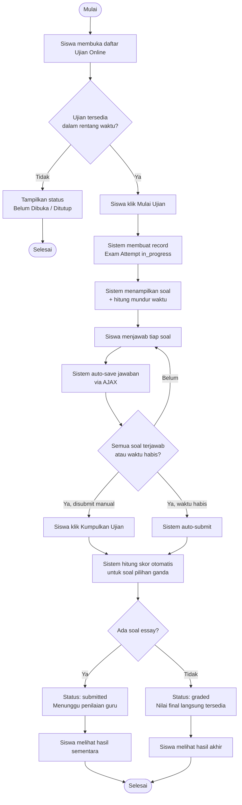

### 2.2 Guru Membuat Tugas dan Menilai

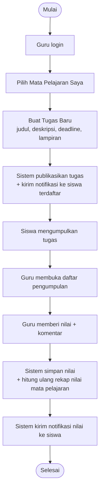

### 2.3 Siswa Mengumpulkan Tugas

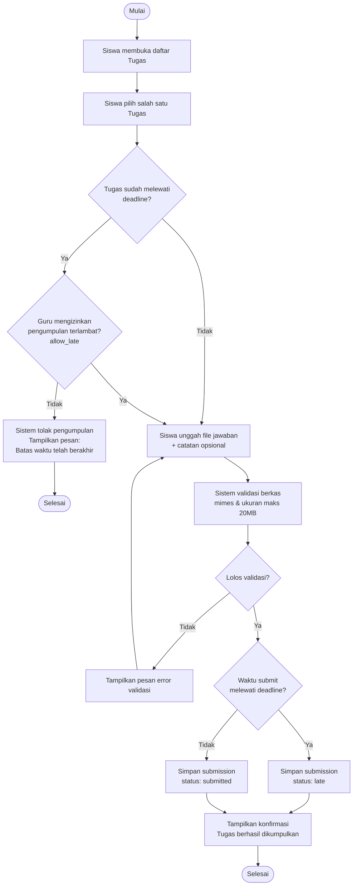

### 2.4 Guru Membuat Kuis/Ujian dengan Soal Pilihan Ganda & Esai

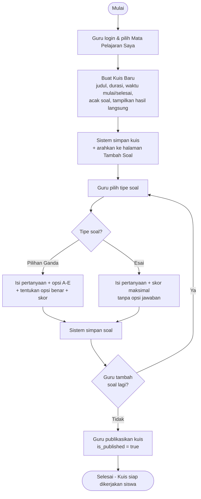

### 2.5 Guru Menginput Presensi

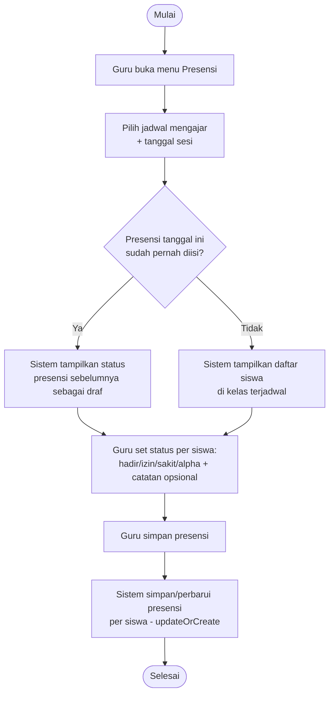

### 2.6 Admin Menghapus Data Master dengan Proteksi Relasi

> Diagram ini memodelkan mekanisme yang secara nyata diuji dan diperbaiki selama pengembangan (lihat Bab IV subbab 4.3.5 &amp; kasus uji TC-06) — contoh kasus: penghapusan akun Guru yang masih mengampu mata pelajaran aktif.

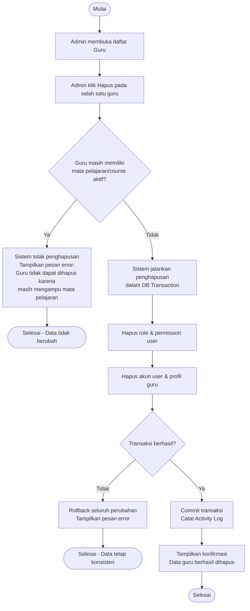

### 2.7 Admin Backup & Restore Database

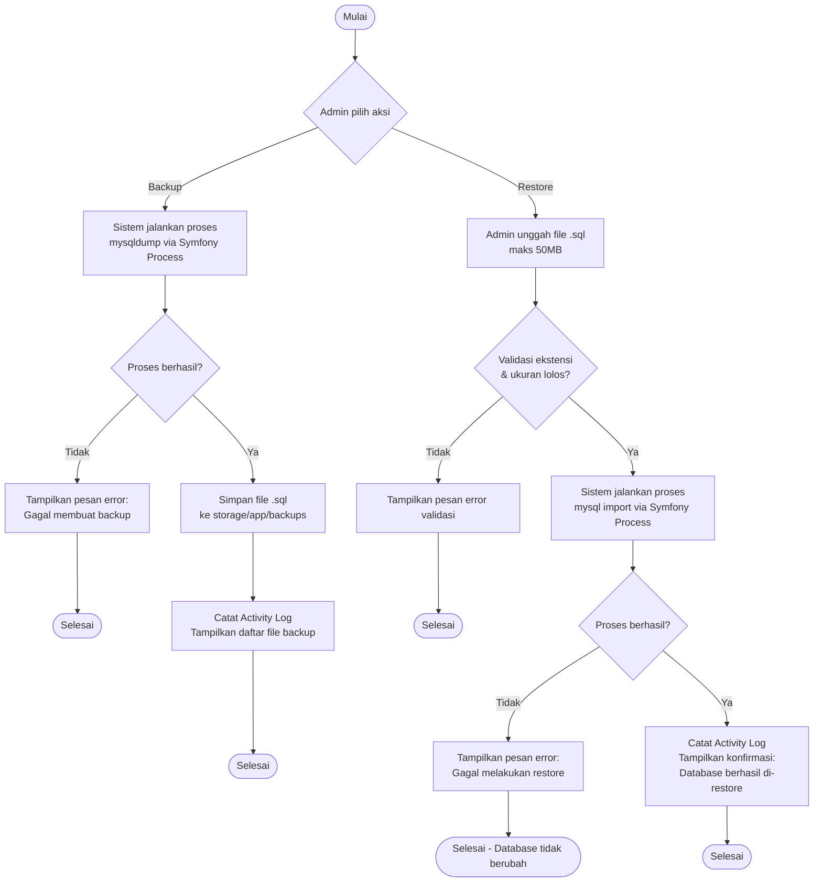

## 3. Sequence Diagram

### 3.1 Login dan Redirect Berdasarkan Peran

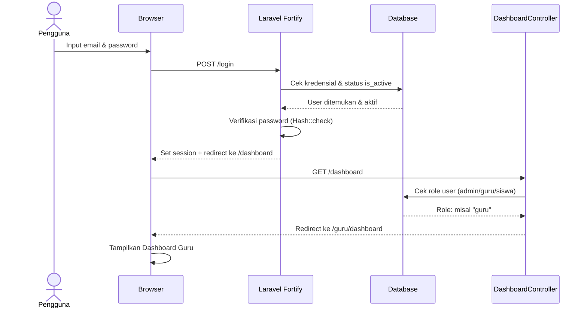

### 3.2 Siswa Mengumpulkan Tugas

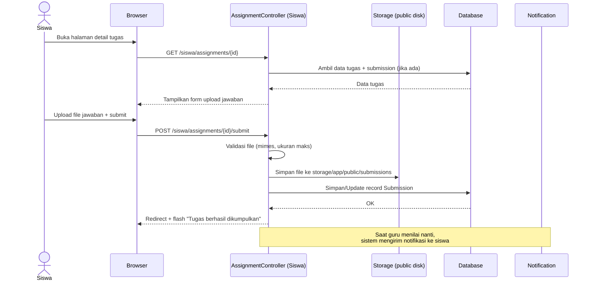

### 3.3 Export Laporan PDF/Excel

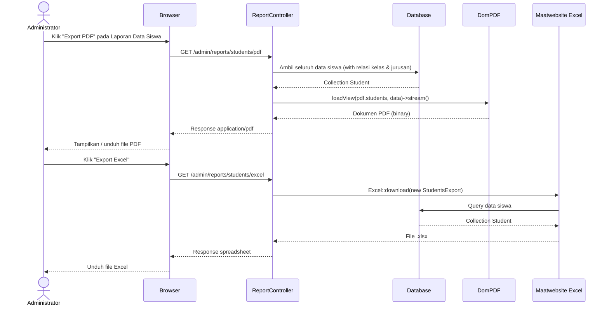

### 3.4 Siswa Menjawab Soal Kuis (AJAX Auto-Save & Auto-Scoring)

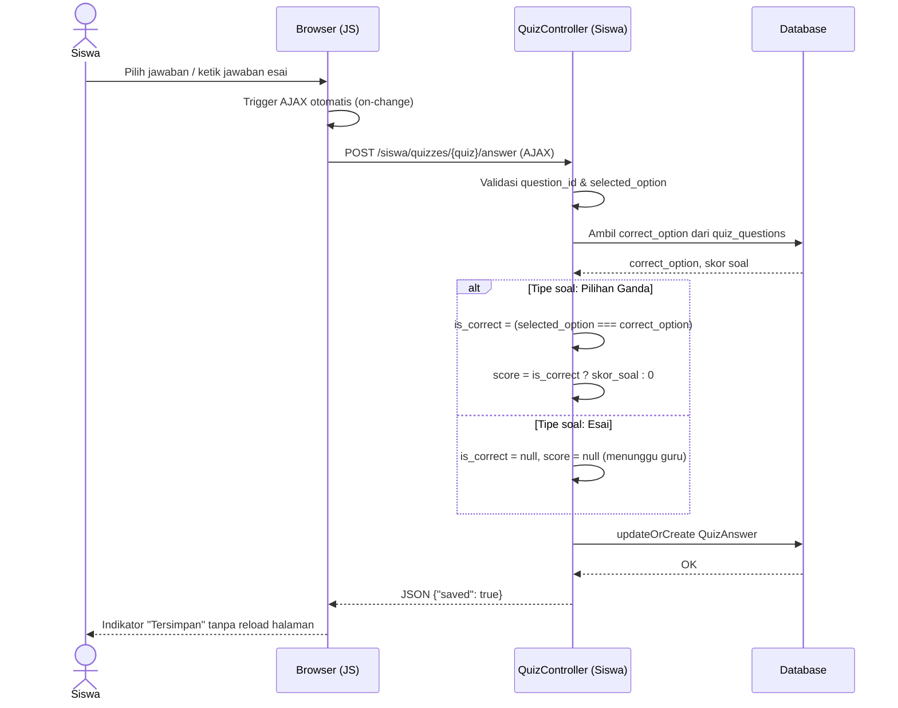

### 3.5 RBAC Middleware — Penolakan Akses Lintas Peran

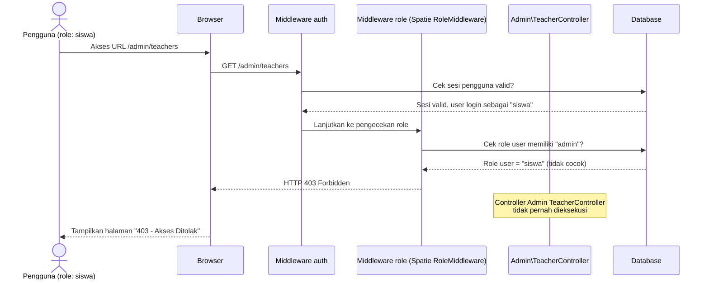

### 3.6 Guru Membuat Tugas → Notifikasi Massal ke Siswa Terdaftar

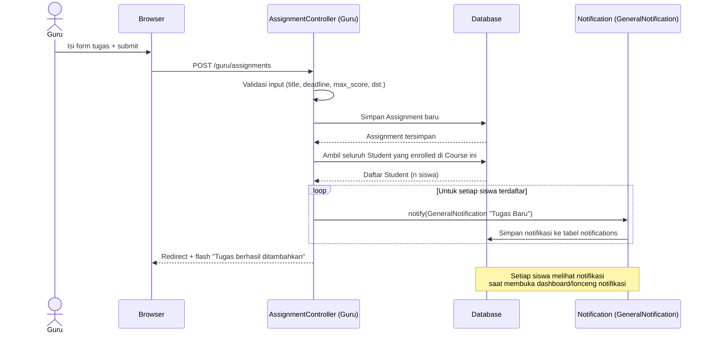

### 3.7 Guru Menilai Tugas → Rekap Nilai Otomatis + Notifikasi

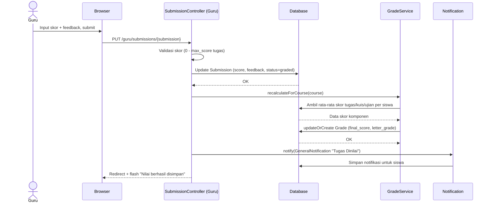

### 3.8 Admin Backup Database ke File SQL

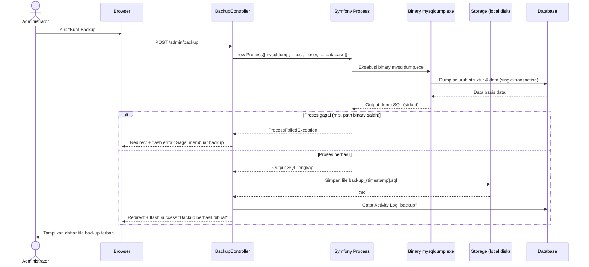

### 3.9 Guru Menilai Esai Kuis Secara Manual

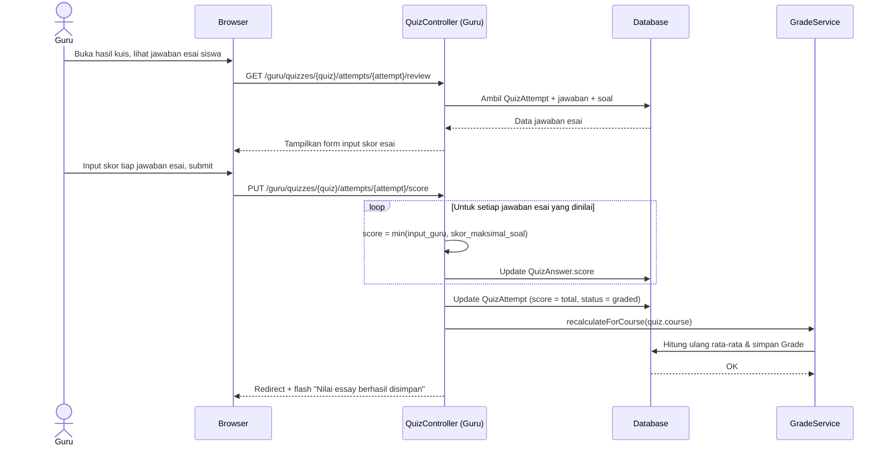

## 4. Class Diagram

Diturunkan langsung dari 28 Model Eloquent di `app/Models/`. Karena seluruh kelas sekaligus akan terlalu padat untuk dibaca, class diagram dipecah menjadi tiga modul yang sejalan dengan pengelompokan entitas pada ERD (bagian 5). Atribut mengikuti `$fillable` masing-masing model; method yang ditampilkan hanya method bisnis publik yang bermakna (bukan relasi `belongsTo`/`hasMany` bawaan Eloquent, karena relasi tersebut sudah direpresentasikan oleh garis panah antarkelas).

### 4.1 Class Diagram — Modul Data Master & Akademik

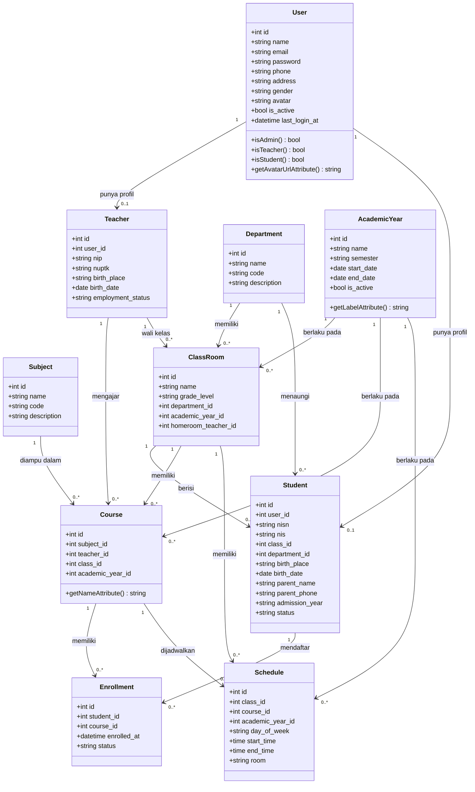

### 4.2 Class Diagram — Modul Pembelajaran & Penilaian

> Kelas `Course`, `Teacher`, `Student`, dan `Schedule` pada diagram ini adalah kelas yang sama dengan Modul Data Master & Akademik (4.1) — ditampilkan tanpa atribut di sini agar relasi tetap terbaca, detail lengkapnya lihat 4.1.

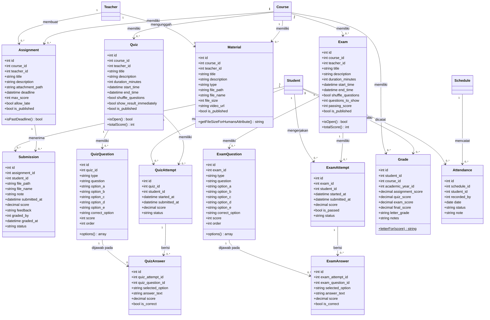

### 4.3 Class Diagram — Modul Komunikasi & Sistem

> Kelas `User` dan `Course` pada diagram ini sama dengan yang ada di 4.1 — ditampilkan tanpa atribut agar relasi tetap terbaca.

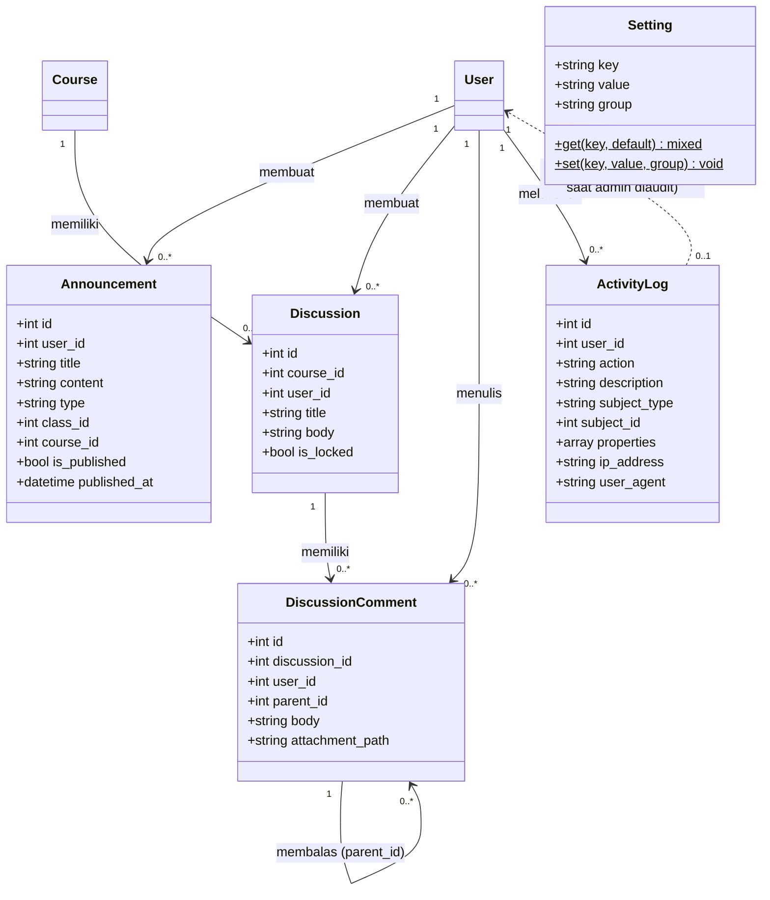
