# Entity Relationship Diagram & Struktur Database — LMS SMKN 9 Garut

Database: **`lms_smkn9garut`** (MySQL/MariaDB, `utf8mb4_unicode_ci`)

## 1. Entity Relationship Diagram

```mermaid
erDiagram
    USERS ||--o| TEACHERS : "punya profil"
    USERS ||--o| STUDENTS : "punya profil"
    USERS ||--o{ ACTIVITY_LOGS : melakukan
    USERS ||--o{ ANNOUNCEMENTS : membuat
    USERS ||--o{ DISCUSSIONS : membuat
    USERS ||--o{ DISCUSSION_COMMENTS : menulis

    DEPARTMENTS ||--o{ CLASSES : memiliki
    DEPARTMENTS ||--o{ STUDENTS : menaungi
    ACADEMIC_YEARS ||--o{ CLASSES : berlaku_pada
    ACADEMIC_YEARS ||--o{ COURSES : berlaku_pada
    ACADEMIC_YEARS ||--o{ SCHEDULES : berlaku_pada
    ACADEMIC_YEARS ||--o{ GRADES : berlaku_pada

    TEACHERS ||--o{ CLASSES : "wali kelas"
    TEACHERS ||--o{ COURSES : mengajar
    TEACHERS ||--o{ MATERIALS : mengunggah
    TEACHERS ||--o{ ASSIGNMENTS : membuat
    TEACHERS ||--o{ QUIZZES : membuat
    TEACHERS ||--o{ EXAMS : membuat
    TEACHERS ||--o{ SUBMISSIONS : menilai

    CLASSES ||--o{ STUDENTS : berisi
    CLASSES ||--o{ COURSES : memiliki
    CLASSES ||--o{ SCHEDULES : memiliki

    SUBJECTS ||--o{ COURSES : diampu_dalam

    COURSES ||--o{ ENROLLMENTS : memiliki
    COURSES ||--o{ SCHEDULES : dijadwalkan
    COURSES ||--o{ MATERIALS : memiliki
    COURSES ||--o{ ASSIGNMENTS : memiliki
    COURSES ||--o{ QUIZZES : memiliki
    COURSES ||--o{ EXAMS : memiliki
    COURSES ||--o{ GRADES : memiliki
    COURSES ||--o{ DISCUSSIONS : memiliki
    COURSES }o--o{ STUDENTS : "melalui enrollments"

    STUDENTS ||--o{ ENROLLMENTS : mendaftar
    STUDENTS ||--o{ SUBMISSIONS : mengumpulkan
    STUDENTS ||--o{ QUIZ_ATTEMPTS : mengerjakan
    STUDENTS ||--o{ EXAM_ATTEMPTS : mengerjakan
    STUDENTS ||--o{ GRADES : memiliki
    STUDENTS ||--o{ ATTENDANCES : dicatat

    SCHEDULES ||--o{ ATTENDANCES : mencatat

    ASSIGNMENTS ||--o{ SUBMISSIONS : menerima

    QUIZZES ||--o{ QUIZ_QUESTIONS : memiliki
    QUIZZES ||--o{ QUIZ_ATTEMPTS : memiliki
    QUIZ_QUESTIONS ||--o{ QUIZ_ANSWERS : dijawab_pada
    QUIZ_ATTEMPTS ||--o{ QUIZ_ANSWERS : berisi

    EXAMS ||--o{ EXAM_QUESTIONS : memiliki
    EXAMS ||--o{ EXAM_ATTEMPTS : memiliki
    EXAM_QUESTIONS ||--o{ EXAM_ANSWERS : dijawab_pada
    EXAM_ATTEMPTS ||--o{ EXAM_ANSWERS : berisi

    DISCUSSIONS ||--o{ DISCUSSION_COMMENTS : memiliki
    DISCUSSION_COMMENTS ||--o{ DISCUSSION_COMMENTS : "membalas (parent_id)"

    USERS {
        bigint id PK
        string name
        string email UK
        string password
        string phone
        enum gender
        boolean is_active
        timestamp last_login_at
    }
    TEACHERS {
        bigint id PK
        bigint user_id FK
        string nip UK
        string nuptk UK
        enum employment_status
    }
    STUDENTS {
        bigint id PK
        bigint user_id FK
        string nisn UK
        string nis UK
        bigint class_id FK
        bigint department_id FK
        enum status
    }
    DEPARTMENTS {
        bigint id PK
        string name
        string code UK
    }
    ACADEMIC_YEARS {
        bigint id PK
        string name
        enum semester
        boolean is_active
    }
    CLASSES {
        bigint id PK
        string name
        enum grade_level
        bigint department_id FK
        bigint academic_year_id FK
        bigint homeroom_teacher_id FK
    }
    SUBJECTS {
        bigint id PK
        string name
        string code UK
    }
    COURSES {
        bigint id PK
        bigint subject_id FK
        bigint teacher_id FK
        bigint class_id FK
        bigint academic_year_id FK
    }
    ENROLLMENTS {
        bigint id PK
        bigint student_id FK
        bigint course_id FK
        enum status
    }
    SCHEDULES {
        bigint id PK
        bigint class_id FK
        bigint course_id FK
        enum day_of_week
        time start_time
        time end_time
    }
    MATERIALS {
        bigint id PK
        bigint course_id FK
        bigint teacher_id FK
        enum type
        string file_path
        boolean is_published
    }
    ASSIGNMENTS {
        bigint id PK
        bigint course_id FK
        bigint teacher_id FK
        datetime deadline
        smallint max_score
    }
    SUBMISSIONS {
        bigint id PK
        bigint assignment_id FK
        bigint student_id FK
        decimal score
        enum status
    }
    QUIZZES {
        bigint id PK
        bigint course_id FK
        bigint teacher_id FK
        smallint duration_minutes
        datetime start_time
        datetime end_time
    }
    QUIZ_QUESTIONS {
        bigint id PK
        bigint quiz_id FK
        enum type
        string correct_option
        smallint score
    }
    QUIZ_ATTEMPTS {
        bigint id PK
        bigint quiz_id FK
        bigint student_id FK
        decimal score
        enum status
    }
    QUIZ_ANSWERS {
        bigint id PK
        bigint quiz_attempt_id FK
        bigint quiz_question_id FK
        string selected_option
        boolean is_correct
    }
    EXAMS {
        bigint id PK
        bigint course_id FK
        bigint teacher_id FK
        smallint passing_score
        smallint questions_to_show
    }
    EXAM_QUESTIONS {
        bigint id PK
        bigint exam_id FK
        enum type
        string correct_option
    }
    EXAM_ATTEMPTS {
        bigint id PK
        bigint exam_id FK
        bigint student_id FK
        decimal score
        boolean is_passed
    }
    EXAM_ANSWERS {
        bigint id PK
        bigint exam_attempt_id FK
        bigint exam_question_id FK
        string selected_option
    }
    GRADES {
        bigint id PK
        bigint student_id FK
        bigint course_id FK
        bigint academic_year_id FK
        decimal assignment_score
        decimal quiz_score
        decimal exam_score
        decimal final_score
        string letter_grade
    }
    ATTENDANCES {
        bigint id PK
        bigint schedule_id FK
        bigint student_id FK
        date date
        enum status
    }
    ANNOUNCEMENTS {
        bigint id PK
        bigint user_id FK
        enum type
        boolean is_published
    }
    DISCUSSIONS {
        bigint id PK
        bigint course_id FK
        bigint user_id FK
        boolean is_locked
    }
    DISCUSSION_COMMENTS {
        bigint id PK
        bigint discussion_id FK
        bigint user_id FK
        bigint parent_id FK
    }
    ACTIVITY_LOGS {
        bigint id PK
        bigint user_id FK
        string action
        string subject_type
        bigint subject_id
    }
    SETTINGS {
        bigint id PK
        string key UK
        text value
    }
```

> Tabel `roles`, `permissions`, `model_has_roles`, `model_has_permissions`, dan `role_has_permissions` dikelola otomatis oleh package **spatie/laravel-permission** untuk kebutuhan RBAC, dan tidak digambarkan detail di atas karena strukturnya baku dari package tersebut.

## 2. Daftar Tabel

| # | Tabel | Keterangan |
|---|---|---|
| 1 | `users` | Akun pengguna (admin/guru/siswa), data profil dasar |
| 2 | `roles`, `permissions`, dst. | RBAC (Spatie Laravel-Permission) |
| 3 | `teachers` | Profil tambahan guru (NIP, NUPTK, status kepegawaian) |
| 4 | `students` | Profil tambahan siswa (NISN, NIS, kelas, status) |
| 5 | `departments` | Jurusan/kompetensi keahlian |
| 6 | `classes` | Kelas/rombongan belajar |
| 7 | `academic_years` | Tahun ajaran & semester |
| 8 | `subjects` | Mata pelajaran |
| 9 | `courses` | Penugasan mengajar (subject + teacher + class + academic_year) |
| 10 | `enrollments` | Pendaftaran siswa ke sebuah course |
| 11 | `materials` | Materi pembelajaran |
| 12 | `assignments` | Tugas |
| 13 | `submissions` | Pengumpulan tugas siswa |
| 14 | `quizzes` | Kuis |
| 15 | `quiz_questions` | Soal kuis |
| 16 | `quiz_attempts` | Sesi pengerjaan kuis siswa |
| 17 | `quiz_answers` | Jawaban siswa per soal kuis |
| 18 | `exams` | Ujian online |
| 19 | `exam_questions` | Bank soal ujian |
| 20 | `exam_attempts` | Sesi pengerjaan ujian siswa |
| 21 | `exam_answers` | Jawaban siswa per soal ujian |
| 22 | `grades` | Rekap nilai akhir per siswa per mata pelajaran |
| 23 | `attendances` | Presensi siswa per sesi jadwal |
| 24 | `announcements` | Pengumuman sekolah/guru |
| 25 | `discussions` | Thread forum diskusi |
| 26 | `discussion_comments` | Komentar/balasan forum diskusi |
| 27 | `schedules` | Jadwal pelajaran mingguan |
| 28 | `notifications` | Notifikasi (Laravel database notifications) |
| 29 | `settings` | Pengaturan sistem (key-value) |
| 30 | `activity_logs` | Log aktivitas pengguna |

## 3. Relasi & Integritas Data

- Semua foreign key menggunakan constraint `ON DELETE` yang sesuai konteks:
  - `cascadeOnDelete()` untuk data anak yang tidak bermakna tanpa induknya (mis. `quiz_questions` ikut terhapus jika `quiz` dihapus).
  - `restrictOnDelete()` untuk mencegah penghapusan data induk yang masih direferensikan (mis. `departments` tidak bisa dihapus jika masih ada `classes`).
  - `nullOnDelete()` untuk relasi opsional (mis. `homeroom_teacher_id` menjadi `NULL` jika guru dihapus).
- Constraint `unique` diterapkan pada kombinasi kolom yang secara bisnis harus unik, misalnya:
  - `courses`: unik per (`subject_id`, `class_id`, `academic_year_id`) — satu mapel hanya diampu oleh satu guru per kelas per tahun ajaran.
  - `enrollments`: unik per (`student_id`, `course_id`).
  - `attendances`: unik per (`schedule_id`, `student_id`, `date`).
  - `quiz_answers`/`exam_answers`: unik per (`attempt_id`, `question_id`).
- Index ditambahkan pada kolom yang sering dipakai untuk filter/pencarian (`is_active`, `is_published`, `status`, `date`, dsb.) untuk menjaga performa query pada skala ratusan-ribuan baris.

## 4. File Dump SQL

File **`database/lms_smkn9garut.sql`** berisi struktur lengkap beserta data contoh (1 admin, 10 guru, 100 siswa, 6 jurusan, 20 kelas, dan seluruh data pendukung lainnya), siap diimpor melalui phpMyAdmin. Lihat [`docs/INSTALLATION.md`](INSTALLATION.md) untuk langkah importnya.
